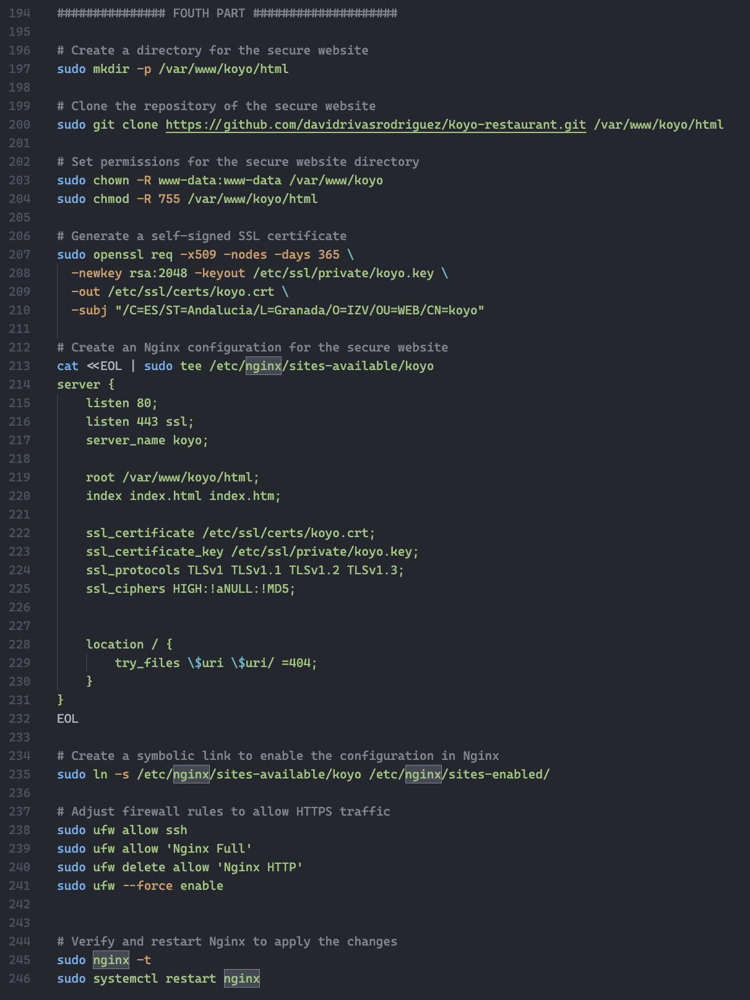
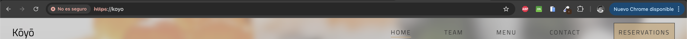

#Práctica 2.3: Acceso seguro con Nginx

##En el provision.sh vamos realizando los pasos a seguir para hacer funcional la web con certificado https

##Confirmamos que funciona el certificado de https

